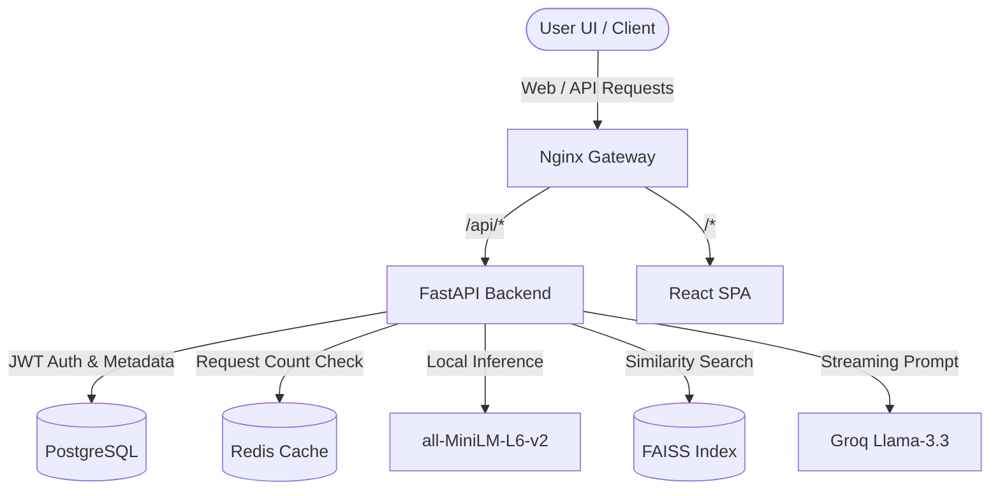

# Platform Architecture & Core Pipelines

This document outlines the software engineering architecture of the RAG platform.

## 1. Document Processing Ingestion Pipeline
When a user uploads a document (PDF, DOCX, TXT, MD):
1. **Physical Write**: The file is stored inside `/app/uploads` under unique generated file names.
2. **Text Parsing**: `FileParser` extracts page-by-page string characters based on file extension.
3. **Overlapping Chunker**: `TextChunker` segments text into sliding chunks of 500 characters with 50 characters overlap to ensure contextual boundaries are not severed.
4. **Relational Sync**: Chunks are inserted into PostgreSQL database under the `document_chunks` table, securing incrementing primary keys (`chunk.id`).
5. **Local Vector Embeddings**: `Embedder` (Sentence Transformers `all-MiniLM-L6-v2`) converts text chunks into a series of 384-dimension floating point arrays.
6. **Vector Index Sync**: The generated arrays are added to the FAISS `IndexIDMap` linked directly to their Postgres `chunk.id` label, and the binary index is written to disk at `/app/vector_store/faiss_index.bin`.

## 2. Conversational RAG Completions Pipeline
When a user sends a query inside a chat session:
1. **Query Reformulation**: The backend fetches the last few messages of history. If history exists, it queries the Groq API to rewrite the follow-up prompt into a standalone vector search query.
2. **Dense Vector Search**: The standalone query is embedded using `all-MiniLM-L6-v2` and searched in the FAISS index to retrieve the top `k` matching chunk IDs.
3. **Database Context Gathering**: The backend fetches the full textual contents of those matching chunk IDs from PostgreSQL.
4. **Context Construction**: Chunks are compiled into the `SYSTEM_RAG_PROMPT` along with page numbers and document names.
5. **SSE Stream completions**: Groq API is called asynchronously, and the response is streamed chunk-by-chunk using Server-Sent Events (SSE).
6. **Persistence logging**: The complete aggregated assistant response and list of citations are committed to the PostgreSQL `chat_messages` table at the end of the stream.
